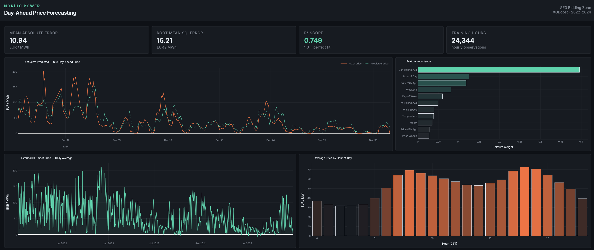

# nordic-power-forecasting

**Lund University Finance Society – Advanced Python Workshops | Final Project**

## Project Description
This project forecasts hourly day-ahead electricity prices on the Nordic power market (SE3 bidding zone) using machine learning. The model combines historical spot prices, weather data (temperature, wind speed), and time-based patterns to predict prices for the coming 24 hours.

**Research question:** Can we predict Nord Pool day-ahead spot prices for SE3 with reasonable accuracy using weather data and historical prices?

## Data Sources
- **Spot prices:** ENTSO-E Transparency Platform – SE3 day-ahead hourly prices (2022–2024)
- **Weather data:** Open-Meteo API – hourly temperature and wind speed for Stockholm

## Methodology

### Feature Engineering
The following features were constructed from raw data:

| Feature | Description |
|---------|-------------|
| `price_lag_24h` | Spot price exactly 24 hours prior |
| `price_lag_48h` | Spot price exactly 48 hours prior |
| `price_lag_168h` | Spot price exactly 7 days prior |
| `price_rolling_24h` | 24-hour rolling average price |
| `price_rolling_168h` | 7-day rolling average price |
| `temperature` | Air temperature in °C |
| `windspeed` | Wind speed in km/h |
| `hour` | Hour of day (0–23) |
| `day_of_week` | Day of week (0 = Monday) |
| `month` | Month of year (1–12) |
| `is_weekend` | Binary flag for Saturday/Sunday |

### Model
An XGBoost Regressor was trained on 80% of the data (2022–early 2024), with the remaining 20% held out as a test set. The data was split chronologically — not shuffled — to reflect realistic forecasting conditions where future prices are unknown at training time.

## Results

| Metric | Value |
|--------|-------|
| MAE | 10.94 EUR/MWh |
| RMSE | 16.21 EUR/MWh |
| R² | 0.749 |

The five most important features were `price_rolling_24h`, `hour`, `price_lag_24h`, `is_weekend`, and `day_of_week` — suggesting that recent price history and time-of-day patterns are the strongest predictors of short-term price movements. Notably, wind speed and temperature ranked lower than expected, likely because their effects are already partially captured by the lagged price features.

## Dashboard


## Running the Project

```bash
pip install -r requirements.txt
python src/data_loader.py   # Fetch weather and price data
python src/eda.py            # Exploratory analysis and feature engineering
python src/model.py          # Train and evaluate the model
python src/dashboard.py      # Launch dashboard at http://localhost:8050
```

> **Note:** An ENTSO-E API key is required to fetch spot price data. Register at [transparency.entsoe.eu](https://transparency.entsoe.eu) and add your key to `src/data_loader.py`.

## Project Structure

```
nordic-power-forecasting/
├── data/                  -> CSV files (generated by scripts)
├── src/
│   ├── data_loader.py     -> Fetches spot prices and weather data
│   ├── eda.py             -> Exploratory analysis, cleaning, feature engineering
│   ├── model.py           -> Model training and evaluation
│   └── dashboard.py       -> Interactive Plotly Dash dashboard
├── requirements.txt
└── README.md
```